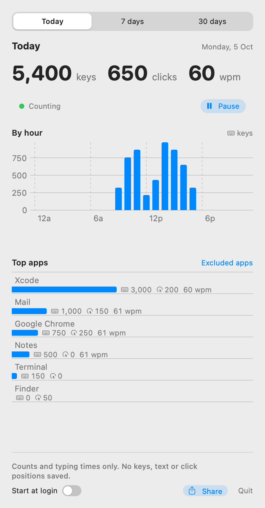
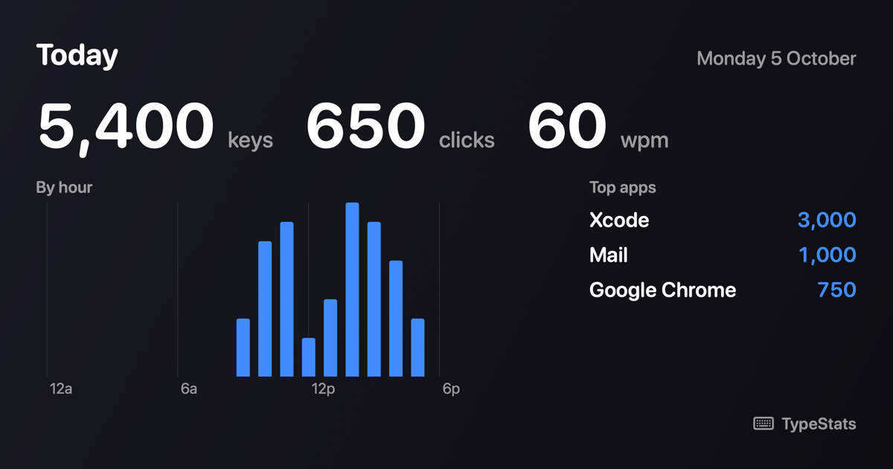

# TypeStats

A small macOS menu bar app that counts how many keys you press and how many times you click,
per app, per hour and per day. It shows today, the last 7 days and the last 30 days, estimates
your typing speed, and can share a summary card.

It stores **counts only**. It never records which key you pressed, any text, or where you
clicked. Your counts stay on your Mac.

<p>
  
</p>



*Screenshots use made-up sample data (`sh scripts/readme-screenshots.sh` renders them).*

## Features

- **Keys and clicks per app.** A key press counts for the frontmost app; a click counts for the
  app whose window is under the pointer. Holding a key down counts once; modifier keys alone
  do not count.
- **Today, 7 days, 30 days.** Totals, a keys-per-hour or keys-per-day chart, and the top apps
  with their keys, clicks and typing speed.
- **Weekly typing hours.** A heatmap in the 7-day popup and shared image shows when you
  typed most. See [how to read it](docs/run.md#views).
- **Typing speed.** An estimate of net words per minute (5 characters to a word, deletions
  subtracted) during steady typing stretches of at least 10 seconds.
- **Share.** Copy an image card, copy a one-line text summary, or save the card as a PNG.
- **Excluded apps.** Never count a password manager or any other app you choose.
- **Pause.** Stop counting for 15 minutes, an hour, or until you resume.
- **Start at login.** One switch in the popup.
- **App updates.** The footer shows your version or "Update available". Click it to open
  App Updates with current and latest versions. "Check for Updates" checks again; when a
  newer release is available, "Update from Homebrew" installs it and restarts TypeStats.
  In-app updates require the Homebrew-installed copy; ZIP and source builds must be
  replaced manually.
  See [update requirements and restart behavior](docs/run.md#app-updates).

## Install

With [Homebrew](https://brew.sh):

```sh
brew install --cask dctmfoo/type-stats/type-stats
```

Or download `TypeStats-<version>.zip` from the
[latest release](https://github.com/dctmfoo/type-stats/releases/latest), unzip it and move
`TypeStats.app` to Applications. Releases are universal (Apple silicon and Intel), signed with a
Developer ID and notarized by Apple. TypeStats needs macOS 14 Sonoma or later.

### First launch

TypeStats appears as a keyboard icon in the menu bar. To see key presses it needs
**Input Monitoring** permission: macOS asks on first launch, or open
System Settings > Privacy & Security > Input Monitoring and switch TypeStats on. Until then the
popup says "Permission needed" and has a button that opens that page. Clicks need no extra
permission.

## Privacy

- Counted: one per key press and one per click, by app, day and hour, plus the number of
  typed characters and the seconds of steady typing used for the speed estimate.
- Never stored: key codes, characters, text, the time of a single press, or click positions.
  The pointer position is used once, to find the app under a click, and then dropped.
- Keys typed into password fields are hidden from every app by macOS, so they are not counted.
- Counts stay in `~/Library/Application Support/TypeStats/` on your Mac. Update checks request
  only the published Homebrew cask from GitHub; no counts or app names are sent. A requested
  update runs Homebrew, which downloads the release. Sharing puts a card or a line on your
  clipboard or in a file you choose.

Keys typed in a terminal count for the terminal app (Terminal, iTerm2, Ghostty, ...), not the
program running inside it, because macOS reports the frontmost app.

## Uninstall

```sh
brew uninstall --cask type-stats          # keeps your counts
brew uninstall --cask --zap type-stats    # also deletes ~/Library/Application Support/TypeStats
```

Without Homebrew, quit TypeStats from its popup, delete the app and, if you want, that folder.

## Build from source

You need Xcode with Swift 6 or later (`xcode-select -p`) on macOS 14 or later.

```sh
swift build                  # compile
swift test                   # unit tests
sh scripts/bundle-app.sh     # build .build/TypeStats.app
open .build/TypeStats.app
sh scripts/install-app.sh    # or: build, install to ~/Applications and open it
```

`scripts/bundle-app.sh` signs with your local "Apple Development" certificate when you have
one, so macOS keeps the Input Monitoring approval across rebuilds; without one it signs ad hoc
and macOS asks again after each rebuild. [docs/run.md](docs/run.md) covers signing, what is
counted, where data lives, the command-line test options and the release process.

## Contributing

Bug reports and pull requests are welcome; see [CONTRIBUTING.md](CONTRIBUTING.md). Please report
security problems privately as described in [SECURITY.md](SECURITY.md).

## License

[MIT](LICENSE)
